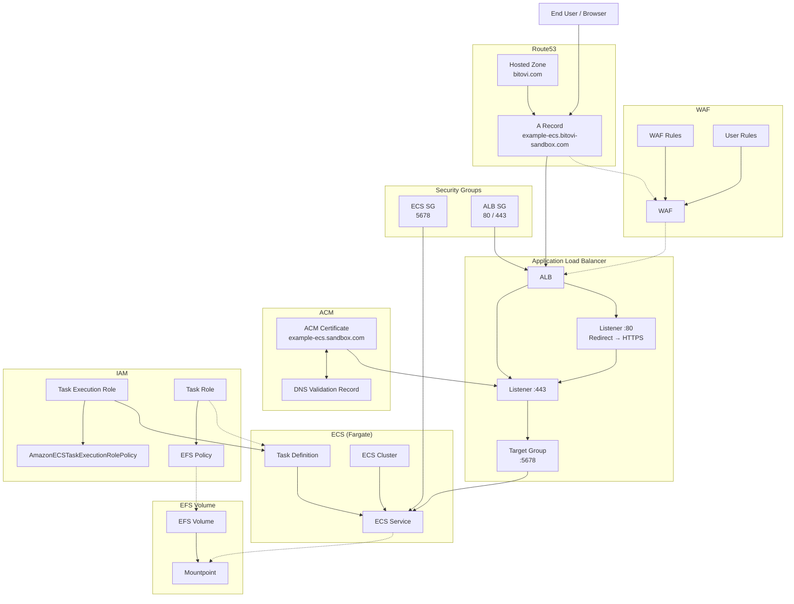

# Deploy an AWS ECS Cluster

`bitovi/github-actions-deploy-ecs` Deploys a ECS Cluster.

This action uses the new GitHub Actions Commons, that is used by many Bitovi GitHub Actions, and so it's constantly evolving and improving.

 ⚠️ BREAKING CHANGES INTRODUCED IN V1
 Migrating from v0.1.* to v1.0.0 is possible. See [migration path](#migration-path) below.

## ‼️ Resource identifiers ‼️ 

#### `aws_resource_identifier` is used as a unique key identifier for naming AWS resources.

### By default, it's made from the following values:

```
${GITHUB_ORG_NAME}-${GITHUB_REPO_NAME}-${GITHUB_BRANCH_NAME}
```

### ‼️ Changing any of these values may result in **unexpected or conflicting resource creation**. ‼️</br>

> ✨ **Multiple deployments:**  
If you need to deploy multiple environments (e.g. `dev`, `staging`, `prod`) within the same repository, explicitly set `aws_resource_identifier` and append the environment name to ensure uniqueness.


## Action Summary
With this action, you can create your ECS (Fargate or EC2) cluster, with tasks and service definitions in a matter of minutes! With an ALB, DNS and even Certificate (if in Route53)

If you would like to deploy a backend app/service, check out our other actions:
| Action | Purpose |
| ------ | ------- |
| [Deploy Docker to EC2](https://github.com/marketplace/actions/deploy-docker-to-aws-ec2) | Deploys a repo with a Dockerized application to a virtual machine (EC2) on AWS |
| [Deploy React to GitHub Pages](https://github.com/marketplace/actions/deploy-react-to-github-pages) | Builds and deploys a React application to GitHub Pages. |
| [Deploy static site to AWS (S3/CDN/R53)](https://github.com/marketplace/actions/deploy-static-site-to-aws-s3-cdn-r53) | Hosts a static site in AWS S3 with CloudFront |
<br/>

**And more!**, check our [list of actions in the GitHub marketplace](https://github.com/marketplace?category=&type=actions&verification=&query=bitovi)

# Need help or have questions?
This project is supported by [Bitovi, A DevOps consultancy](https://www.bitovi.com/services/devops-consulting).

You can **get help or ask questions** on our:

- [Discord Community](https://discord.gg/zAHn4JBVcX)

Or, you can hire us for training, consulting, or development. [Set up a free consultation](https://www.bitovi.com/services/devops-consulting).

# Resources diagram



# Example usage
For basic usage, create `.github/workflows/deploy.yaml` with the following to build on push.

## Basic Use - One container only
One container, exposed in the port 8000, mapped to container port 80. Will return the load balancer URL.
```yaml
name: Deploy ECS Cluster
on:
  push:
    branches: [ main ]
jobs:
  deploy-ecs:
    runs-on: ubuntu-latest
    - name: Create Nginx example
      uses: bitovi/github-actions-deploy-ecs@v1
      id: ecs
      with:
        aws_access_key_id: ${{ secrets.AWS_ACCESS_KEY_ID }}
        aws_secret_access_key: ${{ secrets.AWS_SECRET_ACCESS_KEY }}
        aws_default_region: us-east-1

        #tf_stack_destroy: true # This is to destroy the stack
        tf_state_bucket_destroy: true # Will only destroy the bucket if tf_stack_destroy is true

        aws_ecs_task_cpu: 256
        aws_ecs_task_mem: 512
        aws_ecs_app_image: nginx:latest
        aws_ecs_assign_public_ip: true

        aws_ecs_container_port: 80
        aws_ecs_lb_port: 8000
```

## Advanced Use - 3 Containers, different paths

The example below will create a cluster with 3 tasks, with cloudwatch enabled and DNS usage. 
You'll end up with the following URL -> https://subdomain.your-domain.com
Mapping the 2nd and 3rd container to https://subdomain.your-domain.com/apache/ and https://subdomain.your-domain.com/unit/ (Usefull for FE/BE and something extra)
(Keep in mind the apache container will print a 404 as that path doesn't exist in it.)

```yaml
name: Deploy ECS Cluster Advanced
on:
  push:
    branches: [ main ]
jobs:
  deploy-ecs:
    runs-on: ubuntu-latest
    environment: 
      name: full-stack
      url: ${{ steps.ecs.outputs.ecs_dns_record }}
    steps:
    - name: Create Nginx example
      uses: bitovi/github-actions-deploy-ecs@@v1.0.2
      id: ecs
      with:
        aws_access_key_id: ${{ secrets.AWS_ACCESS_KEY_ID }}
        aws_secret_access_key: ${{ secrets.AWS_SECRET_ACCESS_KEY }}
        aws_default_region: us-east-1

        #tf_stack_destroy: true
        tf_state_bucket_destroy: true

        # Each comma separated value is for each consecutive container
        aws_ecs_task_cpu: 256,512,512 
        aws_ecs_task_mem: 512,1024,1024 
        aws_ecs_app_image: nginx:latest,httpd:latest,public.ecr.aws/nginx/unit
        aws_ecs_assign_public_ip: true

        aws_ecs_container_port: 80,80,80
        aws_ecs_lb_port: 8000,8001,8082
        aws_ecs_lb_redirect_enable: true
        aws_ecs_lb_container_path: 'apache,unit' # Fisrt container will be the URL root path
        aws_ecs_lb_www_to_apex_redirect: true

        aws_ecs_additional_tags: '{\"key\":\"value\",\"key2\":\"value2\"}'

        aws_ecs_cloudwatch_enable: true
        aws_ecs_cloudwatch_lg_name: nginx-leo
        aws_ecs_cloudwatch_skip_destroy: false
        aws_ecs_cloudwatch_retention_days: 1

        aws_waf_enable: true
        aws_waf_logging_enable: true
        aws_waf_log_retention_days: 3
        aws_waf_additional_tags: '{\"some\":\"tag\"}'
        aws_waf_rule_rate_limit: 200
        aws_waf_rule_managed_rules: true
        aws_waf_rule_managed_bad_inputs: true
        aws_waf_rule_ip_reputation: true
        aws_waf_rule_anonymous_ip: true
        aws_waf_rule_bot_control: false #(Extra cost)
        aws_waf_rule_geo_block_countries: "CN,RU"
        #aws_waf_rule_geo_allow_only_countries: "US,CA"
        #aws_waf_rule_user_arn:
        aws_waf_rule_sqli: true
        aws_waf_rule_linux: true
        aws_waf_rule_unix: true
        aws_waf_rule_admin_protection: true

        aws_r53_enable: true
        aws_r53_domain_name: your-domain.com
        aws_r53_sub_domain_name: sub-domain
        aws_r53_enable_cert: true
```

## Advanced Use #2 - Container definitions in a file

The example below will create a cluster using the container definitions from a JSON file. This file could be modified within the same workflow file.

```yaml
      - name: Deploy ECS Web container
        id: ecs-management
        uses: bitovi/github-actions-deploy-ecs@v1
        with:
          aws_access_key_id: ${{ secrets.AWS_ACCESS_KEY_ID }}
          aws_secret_access_key: ${{ secrets.AWS_SECRET_ACCESS_KEY }}
          aws_default_region: ${{ env.AWS_DEFAULT_REGION }}
          aws_resource_identifier: "service-${{ inputs.environment }}"
          
          aws_ecs_task_name: "service-${{ inputs.environment }}"
          aws_ecs_task_json_definition_file: infra/service-task.json
          aws_ecs_task_execution_role: "ecs-task-execution-role-${{ inputs.environment }}"
          aws_ecs_task_cpu: ${{ env.TASK_CPU }}
          aws_ecs_task_mem: ${{ env.TASK_MEM }}
          tf_stack_destroy: ${{ inputs.tf_stack_destroy }}
          tf_state_bucket_destroy: ${{ inputs.tf_stack_destroy }} 

          # web specific
          aws_ecs_assign_public_ip: true
          aws_ecs_node_count: 1
          aws_ecs_container_port: ${{ env.CONTAINER_PORT }}
          aws_ecs_lb_port: ${{ env.LB_PORT }}
          aws_ecs_lb_redirect_enable: true
          aws_ecs_lb_www_to_apex_redirect: true

          # CloudWatch logging
          aws_ecs_cloudwatch_enable: true
          aws_ecs_cloudwatch_lg_name: "/ecs/service/${{ inputs.environment }}"
          aws_ecs_cloudwatch_retention_days: 5

          # WAF settings
          aws_waf_enable: true
          aws_waf_logging_enable: true
          aws_waf_log_retention_days: 3
          aws_waf_rule_rate_limit: 400
          aws_waf_rule_managed_rules: false
          aws_waf_rule_managed_bad_inputs: true
          aws_waf_rule_ip_reputation: true
          aws_waf_rule_anonymous_ip: true
          aws_waf_rule_bot_control: false #(Extra cost)
          #aws_waf_rule_geo_block_countries: "US,CA"
          aws_waf_rule_geo_allow_only_countries: "US,CA"
          aws_waf_rule_user_arn: ${{ vars.AWS_WAF_ARN || '' }}
          aws_waf_rule_sqli: true
          aws_waf_rule_linux: true
          aws_waf_rule_unix: true

          aws_r53_enable: true
          aws_r53_domain_name: ${{ vars.DOMAIN_NAME }}
          aws_r53_enable_cert: true
          aws_r53_root_domain_deploy: true
```

### Example Container Definition

You can find an example ECS Container definition in [`container-definition.example.json`](./container-definition.example.json).

# Inputs

The following inputs can be used as `step.with` keys

## Input groups 
1. [AWS Specific](#aws-specific)
1. [GitHub Commons main inputs](#github-commons-main-inputs)
1. [ECS](#ecs-inputs)
1. [Secrets and Environment Variables](#secrets-and-environment-variables-inputs)
1. [VPC](#vpc-inputs)
1. [WAF](#waf-inputs)
1. [DNS](#dns-inputs)

### Outputs
1. [Action Outputs](#action-outputs)

#### **AWS Specific**
| Name             | Type    | Description                        |
|------------------|---------|------------------------------------|
| `aws_access_key_id` | String | AWS access key ID |
| `aws_secret_access_key` | String | AWS secret access key |
| `aws_session_token` | String | AWS session token |
| `aws_default_region` | String | AWS default region. Defaults to `us-east-1` |
| `aws_resource_identifier` | String | Set to override the AWS resource identifier for the deployment. Defaults to `${GITHUB_ORG_NAME}-${GITHUB_REPO_NAME}-${GITHUB_BRANCH_NAME}`. |
| `aws_additional_tags` | JSON | Add additional tags to the terraform [default tags](https://www.hashicorp.com/blog/default-tags-in-the-terraform-aws-provider), any tags put here will be added to all provisioned resources.|
<hr/>
<br/>

#### **GitHub Commons main inputs**
| Name             | Type    | Description                        |
|------------------|---------|------------------------------------|
| `checkout` | Boolean | Specifies if this action should checkout the code (i.e. whether or not to run the uses: actions/checkout@v3 action prior to deploying so that the deployment has access to the repo files). Defaults to `true`. |
| `bitops_code_only` | Boolean | If `true`, will run only the generation phase of BitOps, where the Terraform and Ansible code is built. |
| `bitops_code_store` | Boolean | Store BitOps generated code as a GitHub artifact. |
| `tf_stack_destroy` | Boolean  | Set to `true` to destroy the stack - Will delete the `elb logs bucket` after the destroy action runs. |
| `tf_state_file_name` | String | Change this to be anything you want to. Carefull to be consistent here. A missing file could trigger recreation, or stepping over destruction of non-defined objects. Defaults to `tf-state-aws`, `tf-state-ecr` or `tf-state-eks.` |
| `tf_state_file_name_append` | String | Appends a string to the tf-state-file. Setting this to `unique` will generate `tf-state-aws-unique`. (Can co-exist with `tf_state_file_name`) |
| `tf_state_bucket` | String | AWS S3 bucket name to use for Terraform state. See [note](#s3-buckets-naming) | 
| `tf_state_bucket_destroy` | Boolean | Force purge and deletion of S3 bucket defined. Any file contained there will be destroyed. `tf_stack_destroy` must also be `true`. Default is `false`. |


#### **ECS Inputs***
| Name             | Type    | Description                        |
|------------------|---------|------------------------------------|
| `aws_ecs_enable`| Boolean | Toggle ECS Creation. Defaults to `true`. |
| `aws_ecs_service_name`| String | Elastic Container Service name. |
| `aws_ecs_cluster_name`| String | Elastic Container Service cluster name. |
| `aws_ecs_service_launch_type`| String | Configuration type. Could be `EC2`, `FARGATE` or `EXTERNAL`. Defaults to `FARGATE`. |
| `aws_ecs_task_type`| String | Configuration type. Could be `EC2`, `FARGATE` or empty. Will default to `aws_ecs_service_launch_type` if none defined. (Blank if `EXTERNAL`). |
| `aws_ecs_task_name`| String | Elastic Container Service task name. If task is defined with a JSON file, should be the same as the container name. |
| `aws_ecs_task_ignore_definition`| Boolean | Toggle to ignore task definition changes after first deployment. Useful when using external tools to manage the task definition. Default: `false`. |
| `aws_ecs_task_execution_role`| String | Task execution role name that the Amazon ECS container agent and the Docker daemon can assume. Defaults to `ecsTaskExecutionRole`. |
| `aws_ecs_task_role` | String | IAM role name that allows your Amazon ECS container task to make calls to other AWS services. When mounting an EFS volume and `aws_ecs_efs_iam` is enabled, will create one specific for that volume if none defined. |
| `aws_ecs_task_reuse_role` | Boolean | Toggle reusing the task execution role as the task role. Defaults to `false`. |
| `aws_ecs_task_json_definition_file`| String | Name of the json file containing container definition. Overrides every other input. |
| `aws_ecs_task_network_mode`| String | Network type to use in task definition. One of `none`, `bridge`, `awsvpc`, and `host`. |
| `aws_ecs_task_cpu`| String | Task CPU Amount. |
| `aws_ecs_task_mem`| String | Task Mem Amount. |
| `aws_ecs_container_cpu`| String | Container CPU Amount. |
| `aws_ecs_container_mem`| String | Container Mem Amount. |
| `aws_ecs_container_user`| String | User to run container as. Accepts `user`, `user:group`, `uid`, `uid:gid`, `user:gid` or `uid:group`. |
| `aws_ecs_node_count`| String | Node count for ECS Cluster. |
| `aws_ecs_app_image`| String | Name of the container image to be used. |
| `aws_ecs_security_group_name`| String | ECS Secruity group name. |
| `aws_ecs_assign_public_ip`| Boolean | Assign public IP to node. |
| `aws_ecs_container_port`| String | Comma separated list of container ports. One for each. |
| `aws_ecs_lb_port`| String | Comma serparated list of ports exposed by the load balancer. One for each. |
| `aws_ecs_lb_redirect_enable`| String | Toggle redirect from HTTP and/or HTTPS to the main port. |
| `aws_ecs_lb_container_path`| String | Comma separated list of paths for subsequent deployed containers. Need `aws_ecs_lb_redirect_enable` to be true. eg. api. (For http://bitovi.com/api/). If you have multiple, set them to `api,monitor,prom,,` (This example is for 6 containers) |
| `aws_ecs_lb_ssl_policy` | String | SSL Policy for HTTPS listener in ALB. Will default to ELBSecurityPolicy-TLS13-1-2-2021-06 if none provided. See [this link](https://docs.aws.amazon.com/elasticloadbalancing/latest/application/create-https-listener.html) for other policies. |
| `aws_ecs_lb_www_to_apex_redirect` | Boolean | Toggle redirect from www to apex domain. `aws_r53_domain_name` must be set. Defaults to `false`. |
| `aws_ecs_autoscaling_enable`| Boolean | Toggle ecs autoscaling policy. |
| `aws_ecs_autoscaling_max_nodes`| String | Max ammount of nodes to scale up to. |
| `aws_ecs_autoscaling_min_nodes`| String | Min ammount of nodes to scale down to. |
| `aws_ecs_autoscaling_max_mem`| String | Define autoscaling max mem. |
| `aws_ecs_autoscaling_max_cpu`| String | Define autoscaling max cpu. |
| `aws_ecs_cloudwatch_enable`| Boolean | Toggle cloudwatch for ECS. Default `false`. |
| `aws_ecs_cloudwatch_lg_name`| String | Log group name. Will default to `aws_identifier` if none. |
| `aws_ecs_cloudwatch_skip_destroy`| Boolean | Toggle deletion or not when destroying the stack. |
| `aws_ecs_cloudwatch_retention_days`| String | Number of days to retain logs. 0 to never expire. Defaults to `14`. |
| `aws_ecs_efs_root_directory` | String | Directory within the FS to mount as the root directory. Defaults to `/`, ignored if `access_point_id` defined. |
| `aws_ecs_efs_transit_encryption` | Boolean | EFS Volume Transit Encryption. Defaults to `true`. (ENABLED) |
| `aws_ecs_efs_transit_encryption_port` | String | EFS Volume Transit Encryption Port. |
| `aws_ecs_efs_access_point_id` | String | EFS Volume Access Point ID to use. |
| `aws_ecs_efs_container_path` | String | Directory path within container to mount the EFS volume to. Defaults to`/mnt/efs` |
| `aws_ecs_efs_readonly` | Boolean | Whether the EFS volume is mounted as read-only. Defaults to `false`. |
| `aws_ecs_efs_iam` | Boolean | Whether or not to use the ECS task IAM role defined in a task definition when mounting the FS. Defaults to `false`. (DISABLED) - Needs `aws_ecs_efs_transit_encryption` |
| `aws_ecs_additional_tags`| JSON | Add additional tags to the terraform [default tags](https://www.hashicorp.com/blog/default-tags-in-the-terraform-aws-provider), any tags put here will be added to ECS provisioned resources.|
<hr/>
<br/>


#### **Secrets and Environment Variables Inputs**
| Name             | Type    | Description - Check note about [**environment variables**](#environment-variables). |
|------------------|---------|------------------------------------|
| `env_aws_secret` | String | Secret name to pull environment variables from AWS Secret Manager. |
| `env_repo` | String | `.env` file containing environment variables to be used with the app. Name defaults to `repo_env`. |
| `env_ghs` | String | `.env` file to be used with the app. This is the name of the [Github secret](https://docs.github.com/es/actions/security-guides/encrypted-secrets). |
| `env_ghv` | String | `.env` file to be used with the app. This is the name of the [Github variables](https://docs.github.com/en/actions/learn-github-actions/variables). |
<hr/>
<br/>

#### **WAF Inputs**
| Name             | Type    | Description                        |
|------------------|---------|------------------------------------|
| `aws_waf_enable` | Boolean | Enable WAF for load balancer (LB only - NOT ELB). Default is `false` |
| `aws_waf_logging_enable`| Boolean | Enable WAF logging to CloudWatch. Default `false` |
| `aws_waf_log_retention_days`| Number | CloudWatch log retention period for WAF logs. Default `30` |
| `aws_waf_rule_rate_limit`| String | Rate limit for WAF rules. Default is `2000`. |
| `aws_waf_rule_rate_limit_priority` | Number | Priority for rate limit rule. Defaults to `10`. |
| `aws_waf_rule_managed_rules` | Boolean | Enable common managed rule groups to use. Defaults to `false`. |
| `aws_waf_rule_managed_rules_priority` | Number | Priority for managed rules. Defaults to `20`. |
| `aws_waf_rule_managed_bad_inputs` | Boolean | Enable managed rule for bad inputs. Defaults to `false`. |
| `aws_waf_rule_managed_bad_inputs_priority` | Number | Priority for bad inputs rule. Defaults to `30`. |
| `aws_waf_rule_ip_reputation` | Boolean | Enable managed rule for IP reputation. Defaults to `false`. |
| `aws_waf_rule_ip_reputation_priority`  | Number | Priority for IP reputation rule. Defaults to `40`. |
| `aws_waf_rule_anonymous_ip`  | Boolean | Enable managed rule for anonymous IP. Defaults to `false`. |
| `aws_waf_rule_anonymous_ip_priority` | Number | Priority for anonymous IP rule. Defaults to `50`. |
| `aws_waf_rule_bot_control` | Boolean | Enable managed rule for bot control (costs extra). Defaults to `false`. |
| `aws_waf_rule_bot_control_priority`  | Number | Priority for bot control rule. Defaults to `60`. |
| `aws_waf_rule_geo_block_countries` | String | Comma separated list of countries to block. Defaults to ``. |
| `aws_waf_rule_geo_block_countries_priority`  | Number | Priority for geo block countries rule. Defaults to `70`. |
| `aws_waf_rule_geo_allow_only_countries`  | String | Comma separated list of countries to allow. Defaults to ``. |
| `aws_waf_rule_geo_allow_only_countries_priority` | Number | Priority for geo allow only countries rule. Defaults to `75`. |
| `aws_waf_rule_sqli`  | Boolean | Enable managed rule for SQL injection. Defaults to `false`. |
| `aws_waf_rule_sqli_priority` | Number | Priority for SQL injection rule. Defaults to `85`. |
| `aws_waf_rule_linux` | Boolean | Enable managed rule for Linux. Defaults to `false`. |
| `aws_waf_rule_linux_priority`  | Number | Priority for Linux rule. Defaults to `90`. |
| `aws_waf_rule_unix`  | Boolean | Enable managed rule for Unix. Defaults to `false`. |
| `aws_waf_rule_unix_priority` | Number | Priority for Unix rule. Defaults to `95`. |
| `aws_waf_rule_admin_protection`  | Boolean | Enable managed rule for admin protection. Defaults to `false`. |
| `aws_waf_rule_admin_protection_priority` | Number | Priority for admin protection rule. Defaults to `100`. |
| `aws_waf_rule_user_arn` | String | ARN of the user rule. Defaults to ``. |
| `aws_waf_rule_user_arn_priority` | Number | Priority for user ARN rule. Defaults to `80`. |
| `aws_waf_additional_tags`| String | A list of strings that will be added to created resources. Default `"{}"` |
<hr/>
<br/>


#### **EFS Inputs**
| Name             | Type    | Descrifption                        |
|------------------|---------|------------------------------------|
| `aws_efs_create` | Boolean | Toggle to indicate whether to create an EFS volume and mount it to the EC2 instance as a part of the provisioning. Note: The stack will manage the EFS and will be destroyed along with the stack. |
| `aws_efs_fs_id` | String | ID of existing EFS volume if you wish to use an existing one. |
| `aws_efs_create_mount_target` | String | Toggle to indicate whether we should create a mount target for the EFS volume or not. Defaults to `false`.|
| `aws_efs_create_ha` | Boolean | Toggle to indicate whether the EFS resource should be highly available (mount points in all available zones within region). |
| `aws_efs_vol_encrypted` | String | Toggle encryption of the EFS volume. Defaults to `true`.|
| `aws_efs_kms_key_id` | String | The ARN for the KMS encryption key. Will use default if none defined. |
| `aws_efs_performance_mode` | String | Toggle perfomance mode. Options are: `generalPurpose` or `maxIO`.|  
| `aws_efs_throughput_mode` | String | Throughput mode for the file system. Defaults to `bursting`. Valid values: `bursting`, `provisioned`, or `elastic`. When using provisioned, also set `aws_efs_throughput_speed`. |
| `aws_efs_throughput_speed` | String | The throughput, measured in MiB/s, that you want to provision for the file system. Only applicable with throughput_mode set to provisioned. |
| `aws_efs_security_group_name` | String | The name of the EFS security group. Defaults to `SG for ${aws_resource_identifier} - EFS`. |
| `aws_efs_allowed_security_groups` | String | Extra names of the security grou-ps to access the EFS volume. Accepts comma separated list of. |
| `aws_efs_ingress_allow_all` | Boolean | Allow access from 0.0.0.0/0 in the same VPC. Defaults to `false`. |
| `aws_efs_create_replica` | Boolean | Toggle whether a read-only replica should be created for the EFS primary file system. |
| `aws_efs_replication_destination` | String | AWS Region to target for replication. |
| `aws_efs_enable_backup_policy` | Boolean | Toggle whether the EFS should have a backup policy. |
| `aws_efs_transition_to_inactive` | String | Indicates how long it takes to transition files to the IA storage class. Defaults to `AFTER_30_DAYS`. |
| `aws_efs_additional_tags` | JSON | Add additional tags to the terraform [default tags](https://www.hashicorp.com/blog/default-tags-in-the-terraform-aws-provider), any tags put here will be added to efs provisioned resources.|
<hr/>
<br/>


#### **VPC Inputs**
| Name             | Type    | Description                        |
|------------------|---------|------------------------------------|
| `aws_vpc_create` | Boolean | Define if a VPC should be created. Defaults to `false`. |
| `aws_vpc_name` | String | Define a name for the VPC. Defaults to `VPC for ${aws_resource_identifier}`. |
| `aws_vpc_cidr_block` | String | Define Base CIDR block which is divided into subnet CIDR blocks. Defaults to `10.0.0.0/16`. |
| `aws_vpc_public_subnets` | String | Comma separated list of public subnets. Defaults to `10.10.110.0/24`|
| `aws_vpc_private_subnets` | String | Comma separated list of private subnets. If no input, no private subnet will be created. Defaults to `<none>`. |
| `aws_vpc_availability_zones` | String | Comma separated list of availability zones. Defaults to `aws_default_region+<random>` value. If a list is defined, the first zone will be the one used for the EC2 instance. |
| `aws_vpc_id` | String | **Existing** AWS VPC ID to use. Accepts `vpc-###` values. |
| `aws_vpc_subnet_id` | String | **Existing** AWS VPC Subnet ID. If none provided, will pick one. (Ideal when there's only one). |
| `aws_vpc_enable_nat_gateway` | Boolean | Adds a NAT gateway for each public subnet. Defaults to `false`. |
| `aws_vpc_single_nat_gateway` | Boolean | Toggles only one NAT gateway for all of the public subnets. Defaults to `false`. |
| `aws_vpc_external_nat_ip_ids` | String | **Existing** comma separated list of IP IDs if reusing. (ElasticIPs). |
| `aws_vpc_additional_tags` | JSON | Add additional tags to the terraform [default tags](https://www.hashicorp.com/blog/default-tags-in-the-terraform-aws-provider), any tags put here will be added to vpc provisioned resources.|
<hr/>
<br/>


#### **DNS Inputs**
| Name             | Type    | Description                        |
|------------------|---------|------------------------------------|
| `aws_r53_enable` | Boolean | Set this to true if you wish to use an existing AWS Route53 domain. **See note**. Default is `false`. |
| `aws_r53_domain_name` | String | Define the root domain name for the application. e.g. bitovi.com'. |
| `aws_r53_sub_domain_name` | String | Define the sub-domain part of the URL. Defaults to `aws_resource_identifier`. |
| `aws_r53_root_domain_deploy` | Boolean | Deploy application to root domain. Will create root and www records. Default is `false`. |
| `aws_r53_enable_cert` | Boolean | Set this to true if you wish to manage certificates through AWS Certificate Manager with Terraform. **See note**. Default is `false`. | 
| `aws_r53_cert_arn` | String | Define the certificate ARN to use for the application. **See note**. |
| `aws_r53_create_root_cert` | Boolean | Generates and manage the root cert for the application. **See note**. Default is `false`. |
| `aws_r53_create_sub_cert` | Boolean | Generates and manage the sub-domain certificate for the application. **See note**. Default is `false`. |
| `aws_r53_additional_tags` | JSON | Add additional tags to the terraform [default tags](https://www.hashicorp.com/blog/default-tags-in-the-terraform-aws-provider), any tags put here will be added to R53 provisioned resources.|
<hr/>
<br/>


#### **Action Outputs**
| Name             | Description                        |
|------------------|------------------------------------|
| `aws_vpc_id` | The selected VPC ID used. |
| `ecs_load_balancer_dns` | ECS ALB DNS Record. |
| `ecs_dns_record` | ECS DNS URL. |
| `ecs_sg_id` | ECS SG ID. |
| `ecs_lb_sg_id` | ECS LB SG ID. |
| `aws_efs_fs_id` | AWS EFS FS ID of the volume. |
| `aws_efs_replica_fs_id` | AWS EFS FS ID of the replica volume. |
| `aws_efs_sg_id` | SG ID for the EFS Volume. |
<hr/>
<br/>

## Contributing
We would love for you to contribute to [`bitovi/github-actions-deploy-ecs`](https://github.com/bitovi/github-actions-deploy-ecs).   [Issues](https://github.com/bitovi/github-actions-deploy-ecs/issues) and [Pull Requests](https://github.com/bitovi/github-actions-deploy-ecs/pulls) are welcome!

## **Migration path**

In order to migrate from v0 to v1, the following path should be taken. **Expect downtime**
1. Set `aws_r53_enable` to `false`, run the action. 
2. Bump to `v1` of the action with `aws_ecs_container_port` and `aws_ecs_lb_port` removed. Run the action.
3. Add ports back. Run the action.
4. Set `aws_r53_enable` to `true`, run the action. 

## Adding external datastore (AWS EFS)
Users looking to add non-ephemeral storage to their created ECS service have the following options; create a new efs as a part of the ECS deployment stack, or mounting an existing EFS. 

### 1. Create EFS

Option 1, set the  `aws_efs_create` to true, which will create an EFS volume for you. You'll need to enable `aws_efs_create_mount_target` or `aws_efs_create_ha` to create the mount target(s).

> :warning: Be very careful here! The **EFS is fully managed by Terraform**. Therefor **it will be destroyed upon stack destruction**.

### 2. Mount EFS
Option 2, you have access to the `aws_ecs_efs_fs_id` attributes, which will make use of an existing EFS Volume. If the volume have mount targets already created, the security group should allow incoming traffic from the ECS Service. If none created or wish to handle them from within the action, clear out all mount points and enable `aws_efs_create_mount_target` or `aws_efs_create_ha`. 

> When mounting an EFS volume and `aws_ecs_efs_iam` is enabled, an `aws_ecs_task_role` policy will be created for that volume if none defined. 

## Note about resource identifiers

Most resources will contain the tag `${GITHUB_ORG_NAME}-${GITHUB_REPO_NAME}-${GITHUB_BRANCH_NAME}`, some of them, even the resource name after. 
We limit this to a 60 characters string because some AWS resources have a length limit and short it if needed.

We use the kubernetes style for this. For example, kubernetes -> k(# of characters)s -> k8s. And so you might see some compressions are made.

For some specific resources, we have a 32 characters limit. If the identifier length exceeds this number after compression, we remove the middle part and replace it for a hash made up from the string itself. 

## Note about tagging

There's the option to add any kind of defined tag's to each grouping module. Will be added to the commons tagging.
An example of how to set them: `{"key1": "value1", "key2": "value2"}`'

### S3 buckets naming

Buckets names can be made of up to 63 characters. If the length allows us to add -tf-state, we will do so. If not, a simple -tf will be added.

## CERTIFICATES - Only for AWS Managed domains with Route53

As a default, the application will be deployed and the ELB public URL will be displayed.

If `aws_r53_domain_name` is defined, we will look up for a certificate with the name of that domain (eg. `example.com`). We expect that certificate to contain both `example.com` and `*.example.com`. 

Setting `aws_r53_create_root_cert` to `true` will create this certificate with both `example.com` and `*.example.com` for you, and validate them. (DNS validation).

Setting `aws_r53_create_sub_cert` to `true` will create a certificate **just for the subdomain**, and validate it.

> :warning: Be very careful here! **Created certificates are fully managed by Terraform**. Therefor **they will be destroyed upon stack destruction**.

To change a certificate (root_cert, sub_cert, ARN or pre-existing root cert), you must first set the `aws_r53_enable_cert` flag to false, run the action, then set the `aws_r53_enable_cert` flag to true, add the desired settings and excecute the action again. (**This will destroy the first certificate.**)

This is necessary due to a limitation that prevents certificates from being changed while in use by certain resources.

## License
The scripts and documentation in this project are released under the [MIT License](https://github.com/bitovi/github-actions-deploy-ecs/blob/main/LICENSE).

# Provided by Bitovi
[Bitovi](https://www.bitovi.com/) is a proud supporter of Open Source software.

# We want to hear from you.
Come chat with us about open source in our Bitovi community [Discord](https://discord.gg/zAHn4JBVcX)!
